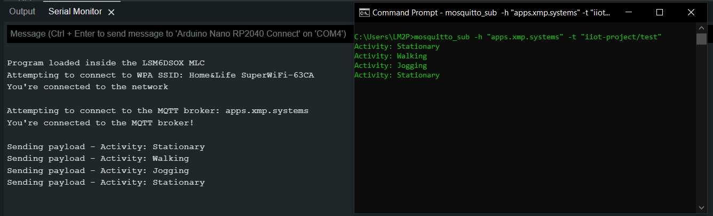
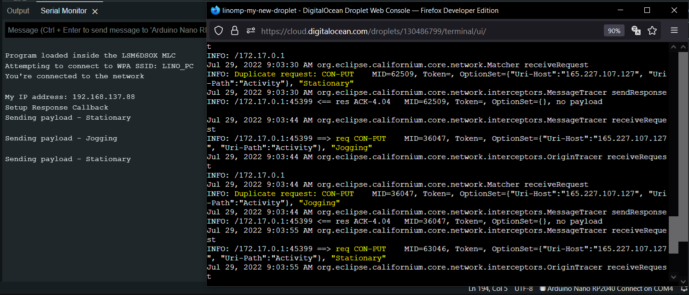

# Motion classification application on an Arduino board supporting multiple IoT Protocols

Final project of the Enabling Technologies for IIoT Summer School by University of Pisa, 2022.

The objective is to develop a motion classification application on an arduino board  (using embedded ML capabilities of the hardware) and connect it to the external world either: 

- by sending the events [through MQTT](./mqtt_version)
- by sending events with the [CoAP protocol](./coap_version/)
- by wrapping it as a ["Web Thing"](./webthings_version/), and monitoring it via a WebThings gateway (available as Docker container, or installed on a Raspberry pi)

### Required hardware:
- [Arduino Nano RP2040 connect](https://docs.arduino.cc/hardware/nano-rp2040-connect)

### Required Libraries:
- [WiFiNINA](https://www.arduino.cc/reference/en/libraries/wifinina/)
- [STM32duino X-NUCLEO-IKS01A3](https://www.arduino.cc/reference/en/libraries/stm32duino-x-nucleo-iks01a3/3)
- [ArduinoMqttClient](https://www.arduino.cc/reference/en/libraries/arduinomqttclient/)
- [CoAP-simple-library](https://www.arduino.cc/reference/en/libraries/coap-simple-library/)
- [webthing](https://webthings.io/framework/)
- [ArduinoMDNS](https://github.com/arduino-libraries/ArduinoMDNS)

### Milestones:

- [X] Sending the current motion status through an MQTT topic to a broker running on my personal DigitalOcean cloud server

    

- [X] Sending the current motion status as a CoAP PUT request to a CoAP test server running on my personal DigitalOcean cloud server

    

### References:

- [Using the IMU Machine Learning Core Features of the Nano RP2040 Connect](https://docs.arduino.cc/tutorials/nano-rp2040-connect/rp2040-imu-advanced)
- [Article about Coap by Adafruit](https://learn.adafruit.com/alltheiot-protocols/coap)
- [WebThings Framework](https://webthings.io/framework/)
- [My starred repositories for this project](https://github.com/stars/linomp/lists/iiot-summer-school-project)
