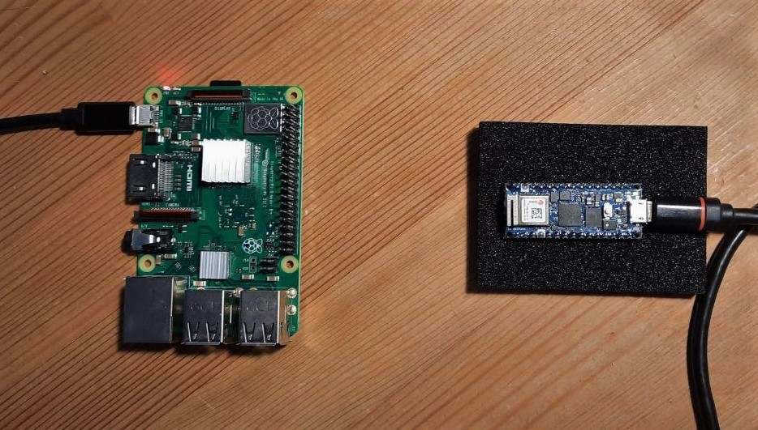
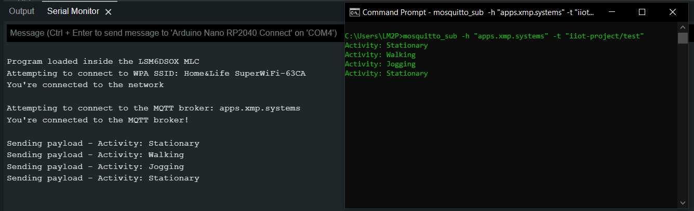
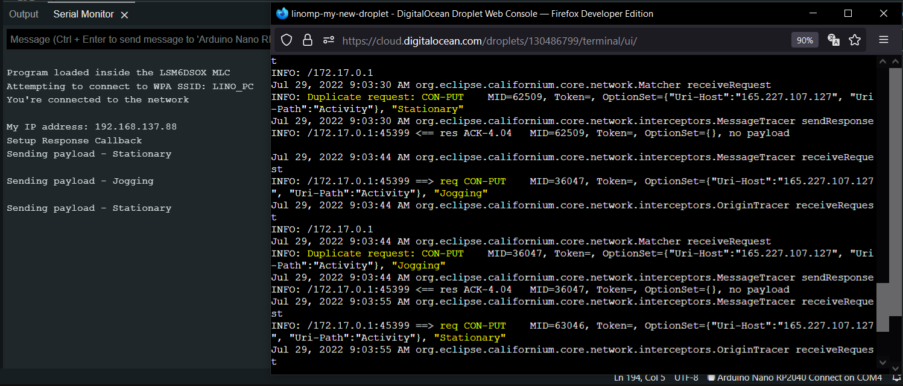
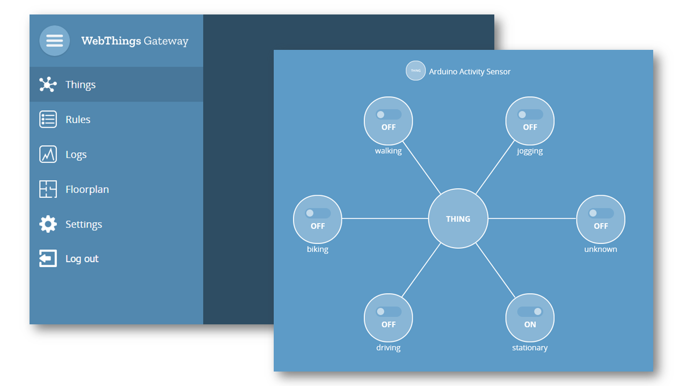
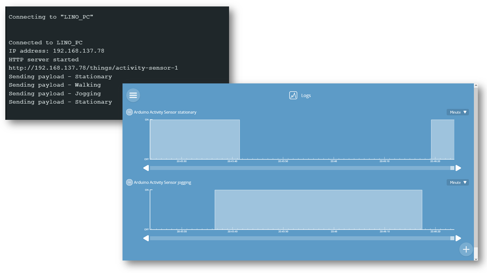

# Motion classification application on an Arduino board supporting multiple IoT protocols

This is a motion classification application for an arduino board  (using embedded ML capabilities of the hardware) that sends events to the external world either: 

- by sending the events [through MQTT](./mqtt_version)
- by sending events with the [CoAP protocol](./coap_version/)
- by declaring a ["Web Thing"](./webthings_version/) interface, allowing to monitor it via a WebThings Gateway running on a Raspberry Pi

It was my final project at the Summer School on Enabling Technologies for IIoT by University of Pisa, 2022.

## Requirements
### Hardware:
- [Arduino Nano RP2040 connect](https://docs.arduino.cc/hardware/nano-rp2040-connect)
- [Raspberry Pi for running the WebThings Gateway software](https://webthings.io/docs/gateway-getting-started-guide.html) (Optional)

### Libraries:
- [WiFiNINA](https://www.arduino.cc/reference/en/libraries/wifinina/)
- [STM32duino X-NUCLEO-IKS01A3](https://www.arduino.cc/reference/en/libraries/stm32duino-x-nucleo-iks01a3/3)
- [ArduinoMqttClient](https://www.arduino.cc/reference/en/libraries/arduinomqttclient/)
- [CoAP-simple-library](https://www.arduino.cc/reference/en/libraries/coap-simple-library/)
- [webthing](https://webthings.io/framework/)
- [ArduinoMDNS](https://github.com/arduino-libraries/ArduinoMDNS)

### Example setup:

## Features

- Send the current motion status through an MQTT topic to a broker running on a cloud server. [(See source code)](https://github.com/linomp/rp2040-webthing/blob/main/mqtt_version/mqtt_version.ino)

  

- Send the current motion status as a CoAP PUT request to a CoAP test server running on a cloud server. [(See source code)](https://github.com/linomp/rp2040-webthing/blob/main/coap_version/coap_version.ino)

  

- Send the current motion status to a WebThings gateway running on a Raspberry Pi on the local network. [(See source code)](https://github.com/linomp/rp2040-webthing/blob/main/webthings_version/webthings_version.ino)

    
    

## References:

- [Using the IMU Machine Learning Core Features of the Nano RP2040 Connect](https://docs.arduino.cc/tutorials/nano-rp2040-connect/rp2040-imu-advanced)
- [Article about Coap by Adafruit](https://learn.adafruit.com/alltheiot-protocols/coap)
- [WebThings Framework](https://webthings.io/framework/)
- [Shawn Hymel's tutorial on WebThings Framework](https://www.youtube.com/watch?v=papxaeII0vo)
- [My starred repositories for this project](https://github.com/stars/linomp/lists/iiot-summer-school-project)
