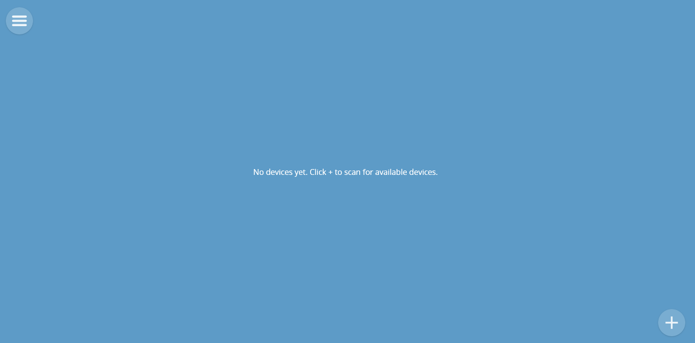
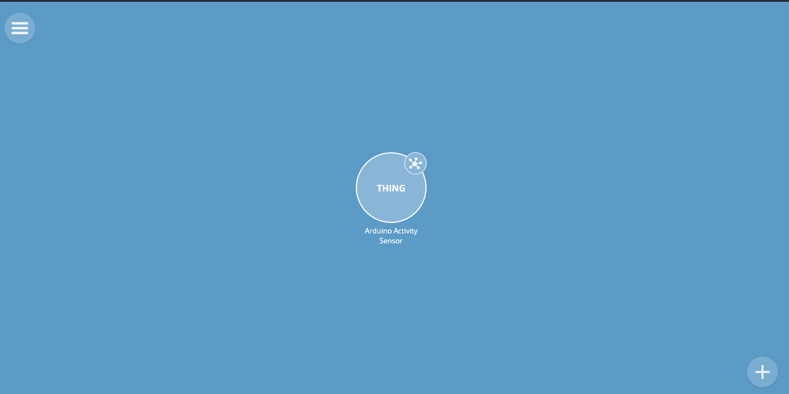
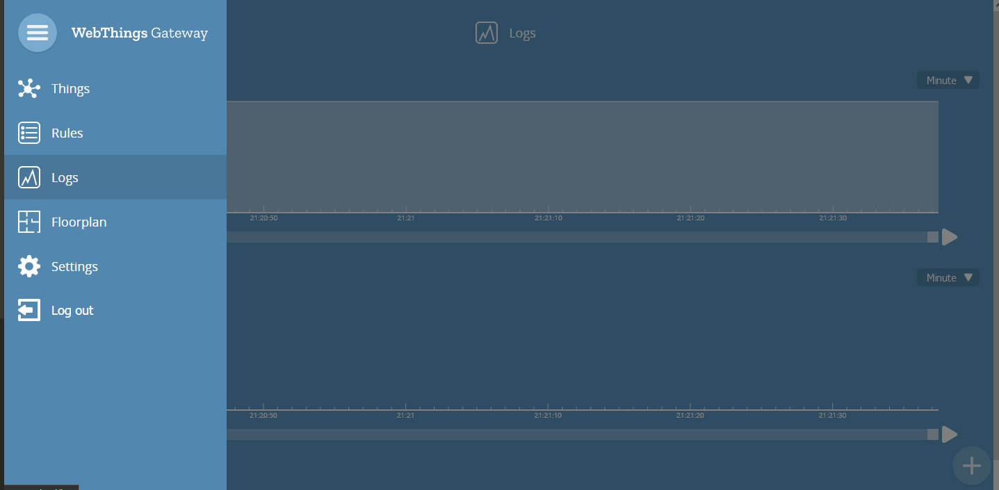

# WebThings Version

This version of the arduino code exposes the functionality as a "Web Thing" using the WebThings framework.

## How to test:

1. Install the open-source WebThings [Gateway Software](https://webthings.io/gateway/) on a Raspberry Pi (also available for Docker & Linux Desktop)

2. Flash and run the arduino code, then wait for the Gateway to detect it or manually type the device url that is shown in the Arduino IDE Serial Monitor

    
    

3. Open the Logs section of the Webthings dashboard and add plots for the property values that you want to inspect (e.g. 'stationary', 'walking', etc.).  Change the view to 'Minutes' for near real-time visualization.

    
